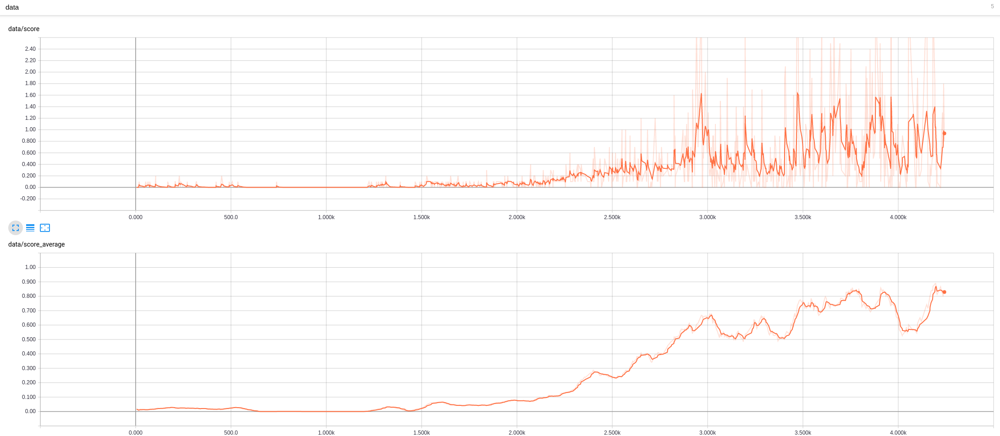

# Project 3: Collaboration and Competition

The project consists of training two agents to play tennis cooperatively.

Each agent will operate a paddle within the tennis Unity environment. The observation space consists of 8x3 variables corresponding to position of paddles and the ball. Each action is a vector with 2 numbers, corresponding to the left right movement and "jump". Every entry in the action vector should be a number between -1 and 1.

A positive reward is given when any agent hits the ball keeping it in the air, so the aim of the agents is to pass each other the ball for as long as possible

The environment is considered solved when the agents reach an average of 0.5 points across the last 100 episodes. I was curious about the stability of the algorithm long term so I made it 0.9 ;)

The project is part of the Udacity deep learning course

## Table of contents


## Getting Started

These instructions will help with setting up the project

### Prerequisites
Create a virtual environment with conda:
```
conda env create -f environment.yml
conda activate drl
```

This will take care of installing all the dependencies needed

### Installing

The following steps allows to setting up the project correctly

Say what the step will be

```
move the 'Tennis_Linux' folder inside 'environment/'
```

## Running the code

The project is divided in two sections: training & evaluation

### Training

To start training the agent run the following:

```
python training.py
```
The code will generate Tensorboard stats for visualisation. You can see them by running:
```tensorboard --logdir=runs``` from the ```drl_collab_compet``` folder

### Evaluation
During each run a snapshot of the agent is taken at regular intervals.

To look at the agent in action using the previously saved model run the following:

```
python evaluate.py
```

## Results
Here is a video of the agent in action:

https://youtu.be/DPbdu2HwDMU

Here is a graph of the progression of the score from Tensorboard (up) and the average of the last 100 scores (down)

The agent successfully reaches an average of 0.5 points around episode 2700
